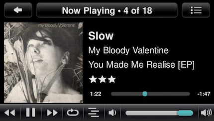
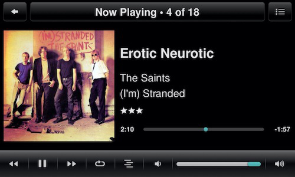

Display ratings on jivelite's *Now Playing* screen
====

This is a mod of [jivelite](https://github.com/ralph-irving/jivelite)'s **NowPlaying** screen that enables the **display of ratings** (pulled from the LMS persistent database) on these devices:

## **SB Radio**
  
   

## **SB Touch**
   

## **piCorePlayer**
  
  

 

Each subfolder contains the modified files for the *NowPlaying* and the *skin* applet + the rating star images. And some basic installation instructions.
  

### Known issues
If you pause a track and then resume playback of the same track it often takes a couple of seconds before the artist and album names are displayed again. If that's a trade-off you can life with is for you to decide.

  

P.S. you can **define a keyword** in the *NowPlayingApplet.lua* (line 127 or 128). If the current track's **comment tag** contains this keyword the **track title gets a slight glow** (see radio screenshot #2).